🚀 Custom ROM Your New Samsung Laggy Budget Devices NOW

Tired of your Samsung budget phone lagging like it’s stuck in molasses? This GitHub Actions workflow is your ticket to reviving devices like the Galaxy A04s, A05, A05s, A06, A16—or any Samsung phone with a super partition and Project Treble support (sorry A12 users, check compatibility first).

It replaces the bloated stock system with a lightweight custom ROM by rebuilding your super.img. No complex setup. No terminal sorcery. Just a few clicks and URLs.

---

🛠️ Why Is This Even Necessary?

0.1. “Why not just use TWRP?”

Because Google made modding hell. They introduced the super partition, which crams system, product, system_ext, and more into a dynamic container. It's great for OTA updates, horrible for custom ROM flashing.

> Samsung didn’t lock you down—Google did, by inventing this overcomplicated super partition setup.

TWRP usually doesn't work well with it, and guess what? Most Samsung budget phones don’t even get official TWRP builds.

0.2. “What’s a Super Partition?”

Think of it as Google’s “smart” storage container that dynamically resizes and holds multiple partitions. Sounds cool, but it makes modding and flashing a nightmare.

---

✅ How to Use

1. Fork or Clone This Repo: Add it to your GitHub account.

2. Go to the "Actions" Tab on your forked repo.

3. Select the Workflow: Choose "Android Super Partition Repack (Build-Only)".

4. Click “Run Workflow” and fill in:

Stock Firmware URL: scroll down to `How to get link for more detail`

Custom System URL: Treble-compatible ROM (.img, .img.xz, .img.gz, or .zip with system.img inside). Use a ROM with equal or higher Android version than your stock firmware.

Optional settings:

Empty Product/System_ext: Use empty product.img or system_ext.img if needed for compatibility.

Silent Mode: Reduces log spam (enabled by default).

Writable Partitions: Enables read-write system (only useful if you modify fstab).

Purge All: Deletes temporary files after the build to save space (enabled by default).

> ⚠️ You can leave most options at default unless you know what you’re doing.

5. Wait 10–20 Minutes: After the run, go to the Artifacts section and download repacked_super.zip.

6. Flash the Repacked Super Image:

Odin users: Extract repacked_super.tar and flash it using the AP slot.

Heimdall users: Use the included heimdall_flash.sh script.

7. Reboot to Recovery and Format Data:

Keep your phone connected via USB.

Hold Vol DOWN + Power, then switch to Vol UP + Power to enter Recovery.

Wipe data to avoid boot loops or soft-bricks.

---

🖼️ How to Get the Download Links (Tutorial)

Follow these example steps and screenshots to get the correct download links for both your stock firmware and custom ROM:

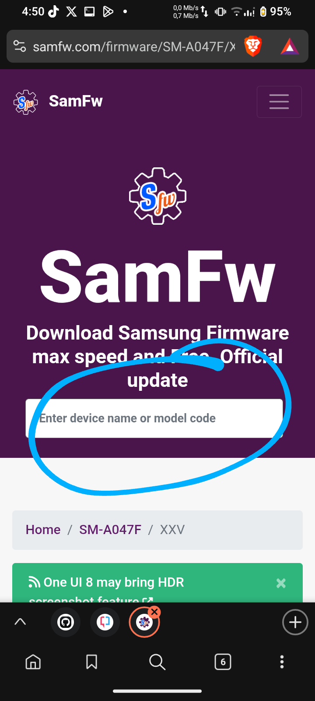

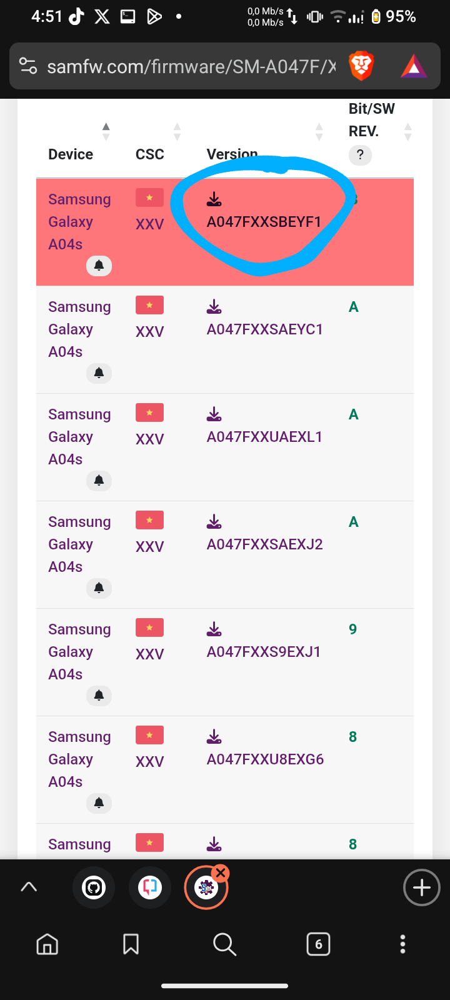

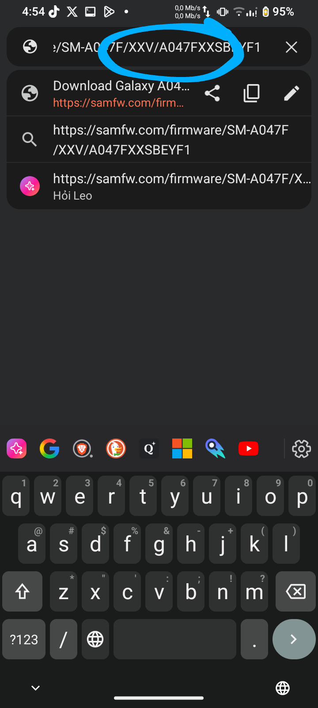

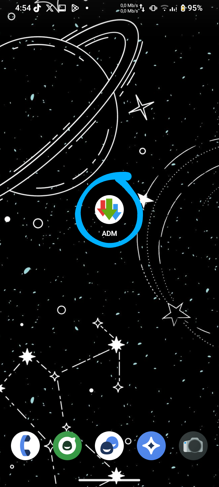

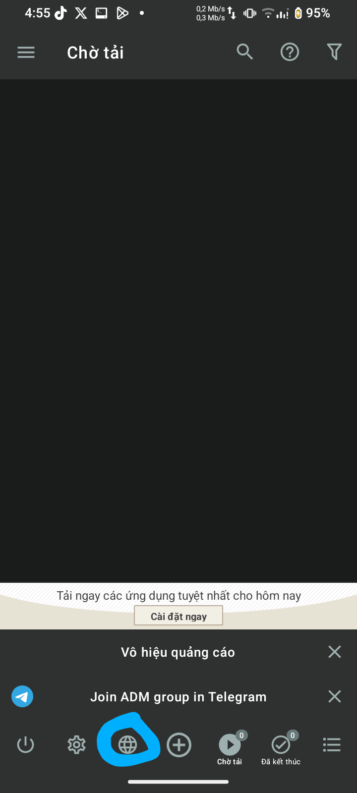

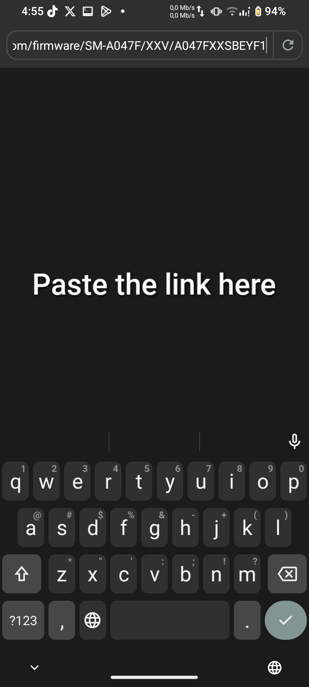

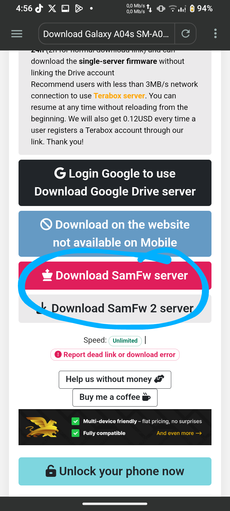

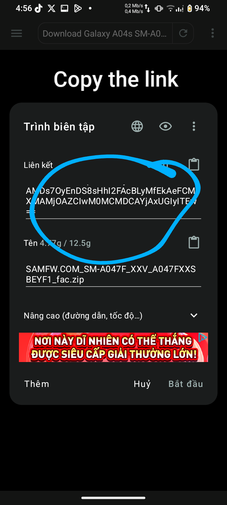

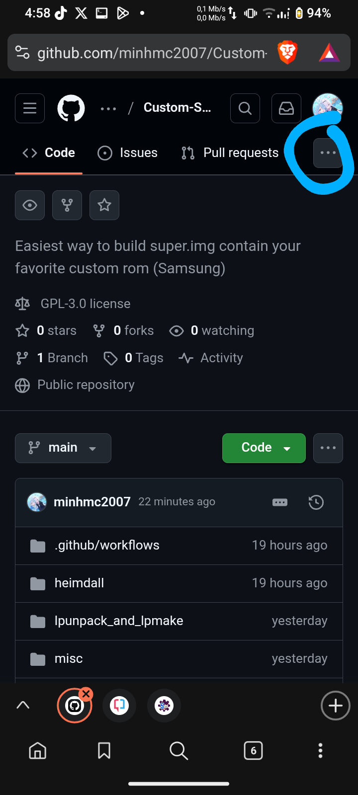

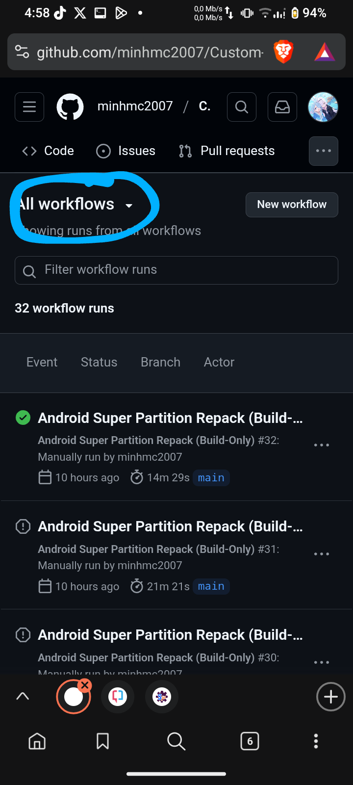

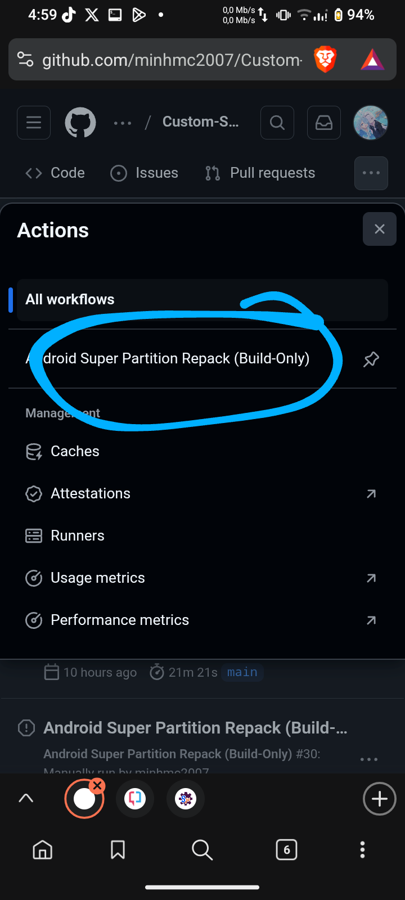

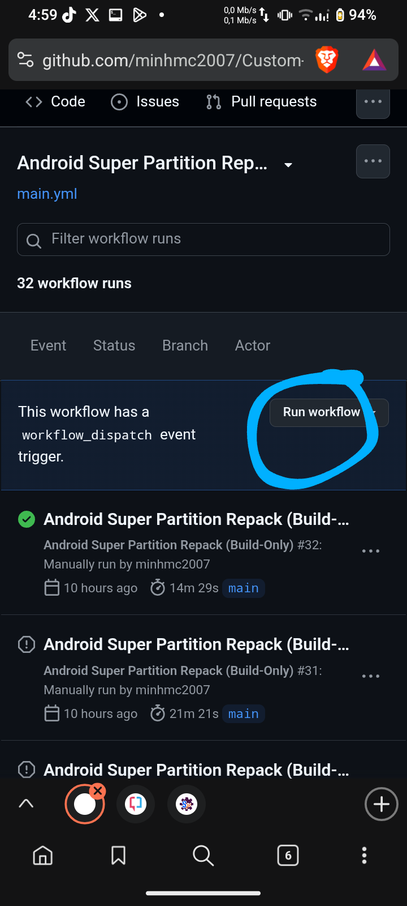

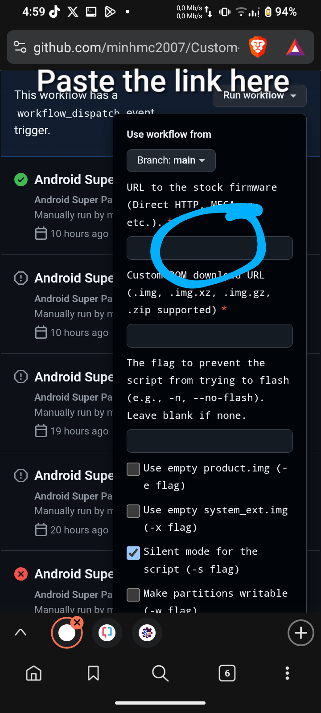
---

✨ Features

✅ Supports Samsung budget phones: A04s, A05, A05s, A06, A16, and more.

📦 Accepts .img, .img.xz, .img.gz, or .zip (with system.img) custom ROMs.

💨 Replaces Samsung’s bloated OneUI with clean, fast ROMs like LineageOS, Pixel Experience, or Miku UI.

💾 Caches stock firmware for future builds to reduce download time.

🧹 Auto-cleans space on GitHub Actions to prevent build failures.

🧠 Includes advanced options like writable partitions and empty overlays.

🖥️ Runs 100% in the cloud—no tools needed on your PC.

---

📦 Requirements

A Samsung device with:

Super partition

Project Treble support

Direct URLs to:

Your stock firmware (AP_*.tar.md5)

A custom system image (system.img or .zip with it inside)

Some basic flashing knowledge (Odin or Heimdall)

---

🧙 How It Works

1. Downloads & Extracts:

Downloads stock firmware and custom ROM.

Extracts the original super.img from the AP_*.tar.md5.

Prepares and decompresses your custom ROM as needed.

2. Frees Up Space:

Cleans up GitHub runner files.

Deletes unnecessary packages and files to avoid “no space” errors.

3. Repacking Process:

Runs repacksuper.sh with your custom system.img.

Applies selected options like empty product.img, writable mode, etc.

4. Packaging:

Verifies the repacked image was created.

Builds a .tar for Odin flashing.

Uploads results as downloadable artifacts.

5. Caching & Cleanup:

Stores the stock firmware for later runs.

Cleans temp files to keep things efficient.

---

🧯 Troubleshooting

“No space left on device”: Try smaller firmware or check logs—GitHub storage is limited.

“AP file not found”: Make sure you're using the AP_*.tar.md5 file, not just any firmware blob.

“Unsupported file format”: Use a proper .img, .xz, .gz, or .zip with system.img inside.

Not booting?: Format data in recovery, check your ROM architecture (arm64-ab), and ensure the Android version matches or exceeds stock.

---

📜 License

This workflow is licensed under the GNU GPL v3 License.
The repacksuper.sh script is originally by Uluruman.

---

🙏 Thanks

Huge thanks to Uluruman for the original repacking script that powers this workflow.

---

👷 Contributing

Found a bug? Got a feature idea?
PRs and Issues are welcome—let’s fix laggy Samsungs together.

---

⚠️ Disclaimer

> Flashing custom ROMs can brick your device or void your warranty.
Always back up your data and proceed at your own risk.
This project is provided as-is with no guarantees.
